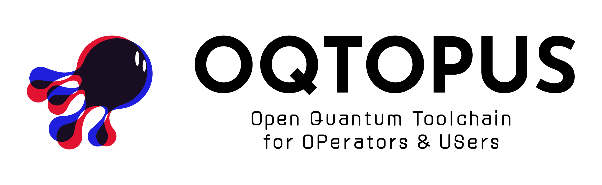
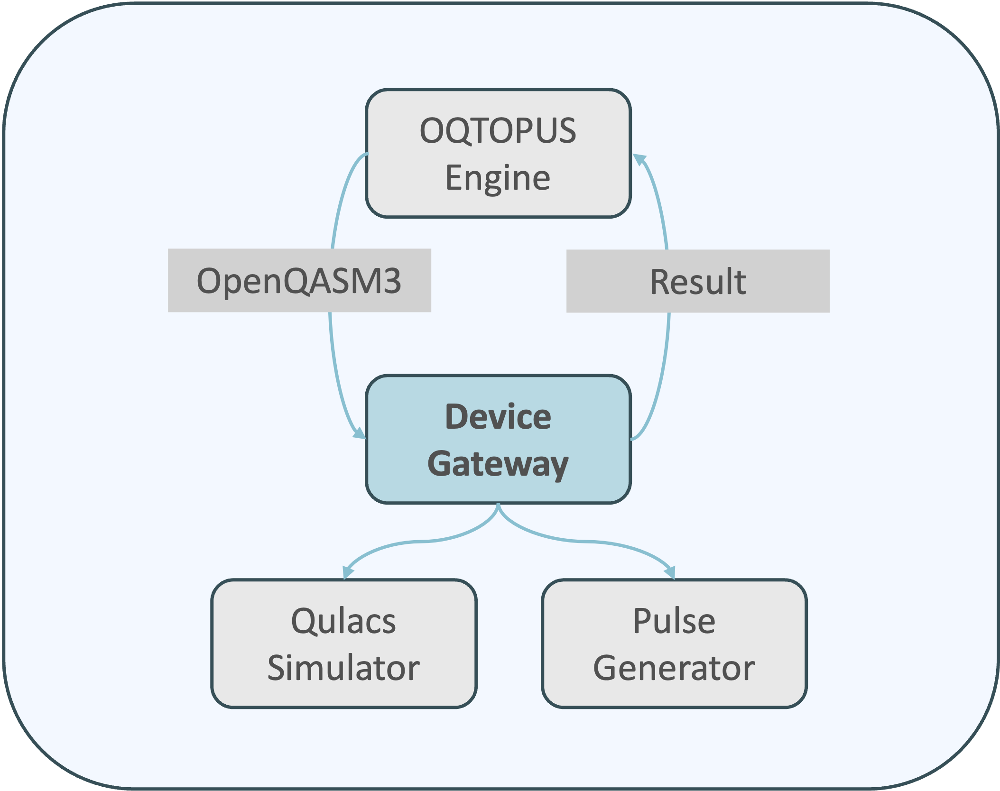

# Device Gateway

## Overview

The device-gateway is a server that translates OpenQASM3 instructions into commands compatible with various quantum control software platforms. It maintains calibration data and device topology information, enabling the mapping of virtual qubits specified in the OpenQASM code to physical qubits during the pulse generation process. The system employs gRPC for efficient remote procedure calls. Its modular backend architecture supports integration with diverse quantum control software and simulators, with the current implementation utilizing Qulacs as the simulator backend. Moreover, the device-gateway operates in close collaboration with the oqtopus-engine.

## Documentaiton

- [Documentation Home](https://device-gateway.readthedocs.io/)

## Citation

You can use the DOI to cite Device Gateway in your research.

Citation information is also available in the [CITATION](https://github.com/oqtopus-team/device-gateway/blob/main/CITATION.cff) file.

## Contact

You can contact us by creating an issue in this repository or by email:

- [oqtopus-team[at]googlegroups.com](mailto:oqtopus-team[at]googlegroups.com)

## License

Tranqu is released under the [Apache License 2.0](https://github.com/oqtopus-team/device-gateway/blob/main/LICENSE).
